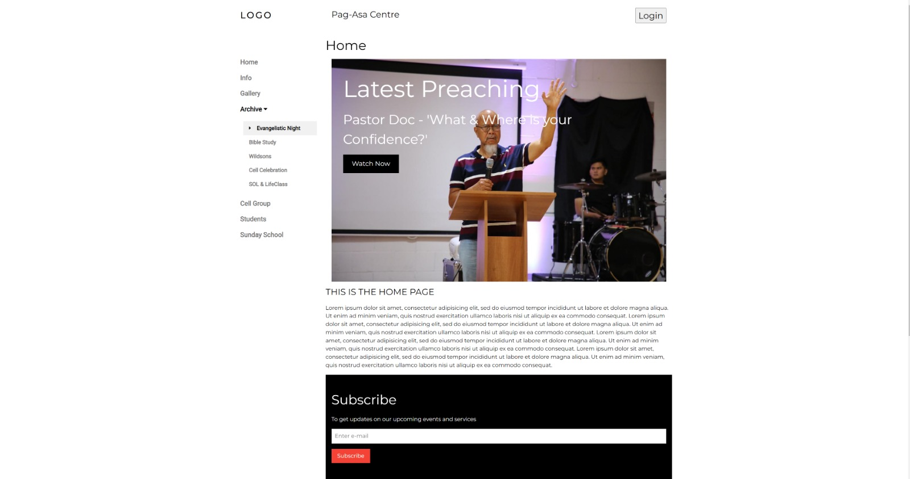
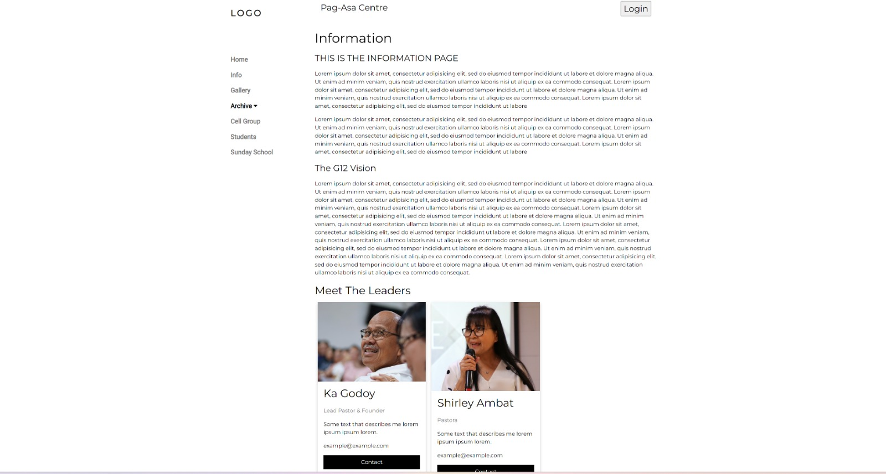

# Pagasa-Centre-Website
> A website for my local Church.

## Table of Contents
* [General Information](#general-information)
* [Technologies Used](#technologies-used)
* [Features](#features)
* [Screenshots](#screenshots)
* [Project Status](#project-status)
* [Room for Improvement](#room-for-improvement)
* [Acknowledgements](#acknowledgements)
* [Setup](#setup)
* [Usage](#usage)
* [Contact](#contact)

## General Information
This project is a website I made for my local church. They had been using a facebook page to handle posts of upcoming events, live preachings and share information for many years.
So I decided to take on the challenge of creating my professional website for a client. This was a very fun project because I started it without knowing half the technologies I used and how on earth I was going to implement half the features in it but in the end with the help of alot of googling and perseverance, I managed to do it. This was a great learning experience! :)

## Technologies Used
* Python version: 3.10.8
* Django version: 4.1.2
* PostgreSQL
* Amazon Web Services(RDS)
* HTML
* CSS
* JavaScript

## Screenshots

## Project Status
_in progress_ 

## Room for Improvement

Room for improvement:

N/A

To do:
- integrate AWS RDS
- Create login in a register feature
- Use Youtube API to retrieve Church Preachings
- Image & video upload feature FOR gallery page
- Create Student page
- Create Sunday School page

## Acknowledgements
Give credit here.
- This project was inspired by [Life.Church TV](https://www.life.church/)
- This project was based on multiple tutorials and google searches. However the main person I would like to shout out is [Dennis Ivy](https://www.youtube.com/c/DennisIvy) for his amazing Django Tutorials.
- Many thanks to Jesus Christ for giving me the strength and discipline to see this project through.

## Setup
N/A

## Usage
N/A

## Contact
Created by [Lionel Wilson](https://github.com/Lionel-Wilson) - feel free to contact me via email at Lionel_Wilson@outlook.com !
